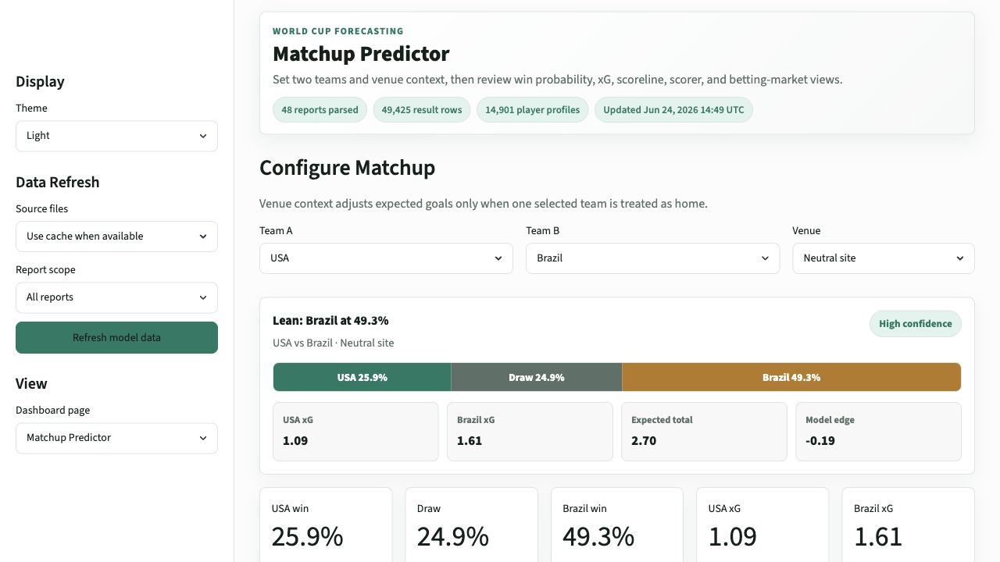
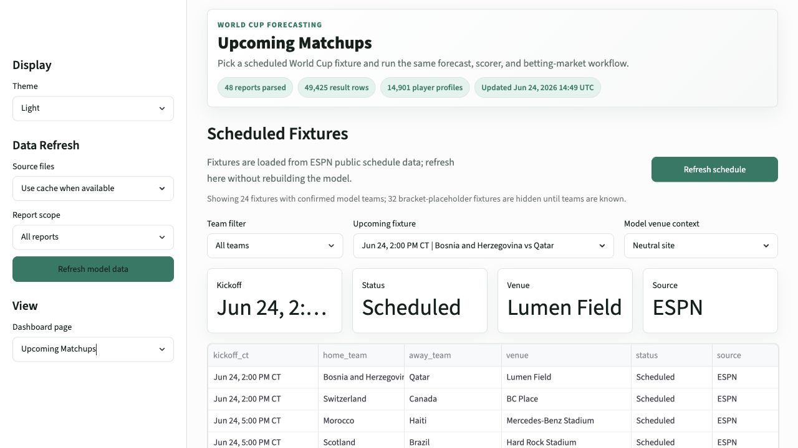
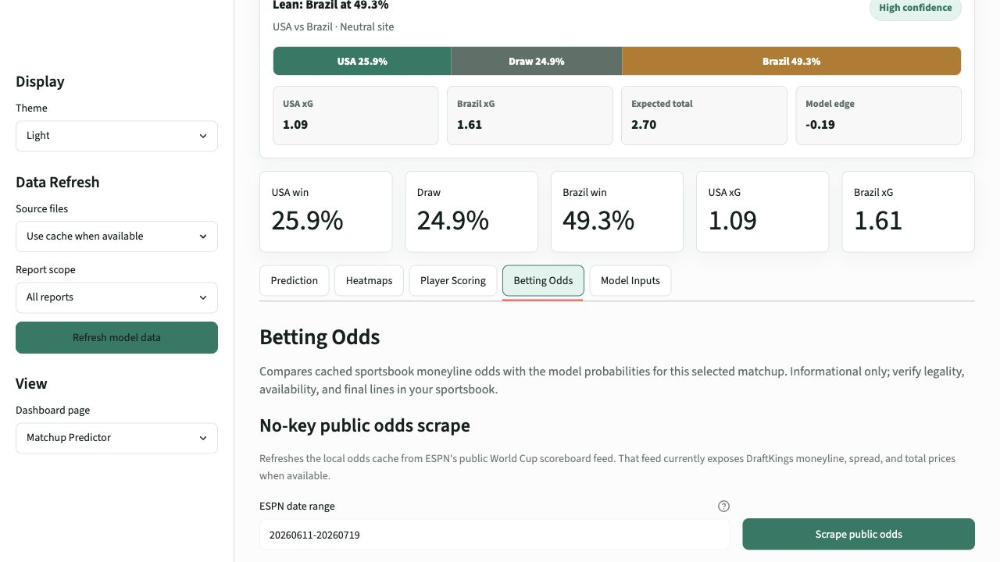
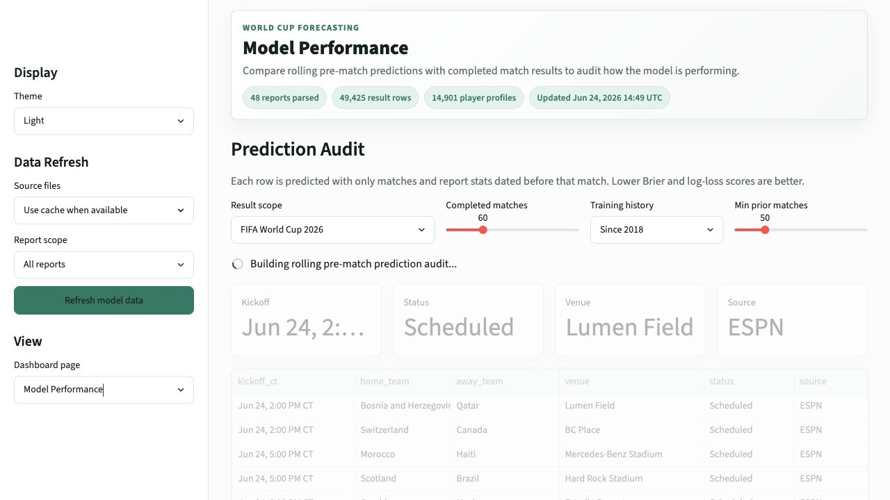
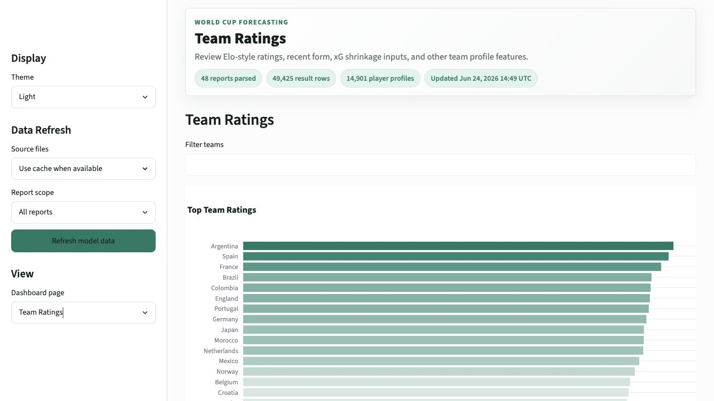
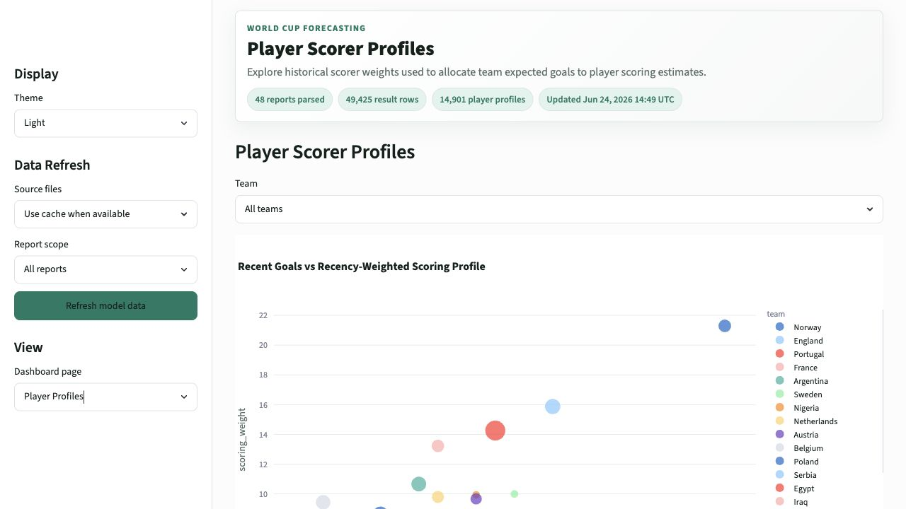

# World Cup Prediction Dashboard

A Streamlit dashboard for exploring FIFA World Cup match forecasts, scoreline probabilities, estimated player scoring chances, sportsbook odds comparisons, and rolling model-performance audits.

This repository folder is prepared for Streamlit Community Cloud. It is a standalone deployment copy and does not depend on the parent local project folder.

## Contents

- [What The Dashboard Does](#what-the-dashboard-does)
- [Dashboard Walkthrough](#dashboard-walkthrough)
- [Model Methodology](#model-methodology)
- [Data Included In This Deploy Copy](#data-included-in-this-deploy-copy)
- [Run Locally](#run-locally)
- [Deploy To Streamlit Cloud](#deploy-to-streamlit-cloud)
- [Operational Notes](#operational-notes)
- [Limitations](#limitations)

## What The Dashboard Does

The app combines public historical international results, parsed FIFA 2026 match-report data, StatsBomb open-data team features, goalscorer history, public schedule data, and available bookmaker odds into one workflow:

- Configure any two teams and generate a win/draw/loss forecast.
- Review expected goals, most likely scores, scoreline heatmaps, and total-goals probabilities.
- Estimate player scoring probabilities from historical goalscorer records.
- Compare model probabilities against cached sportsbook odds when public odds are available.
- Select upcoming fixtures directly from a public ESPN schedule feed.
- Audit completed matches by comparing rolling pre-match predictions with actual results.

The dashboard is for research and educational use. It is not betting advice.

## Dashboard Walkthrough

### 1. Matchup Predictor

Use `Matchup Predictor` to select two teams and a venue context. The page shows the model lean, win probabilities, expected goals, most likely score, and tabs for deeper forecast views.



What to look at:

- `Lean` summarizes the highest-probability result.
- `USA win`, `Draw`, and `Brazil win` show the 1X2 forecast.
- `xG` values drive the Poisson scoreline matrix.
- `Prediction`, `Heatmaps`, `Player Scoring`, `Betting Odds`, and `Model Inputs` tabs explain the forecast from different angles.

### 2. Upcoming Matchups

Use `Upcoming Matchups` to choose from scheduled fixtures instead of manually selecting teams. The page uses ESPN's public schedule feed, filters out bracket placeholders, and runs the same model workflow as the manual matchup page.



What to look at:

- `Refresh schedule` reloads only the schedule feed.
- `Team filter` narrows the fixture list.
- `Model venue context` lets you keep the match neutral or test home-side assumptions.
- Bracket-placeholder fixtures are hidden until the teams are known.

### 3. Betting Odds

The `Betting Odds` tab compares cached sportsbook prices with the model's probabilities. The default no-key public flow uses ESPN public odds when those odds are exposed.



What to look at:

- `Best available odds` summarizes the strongest cached price by outcome.
- `Model edge` and expected-value columns show where the model disagrees with market-implied probabilities.
- Spread and total rows are supported when available in the feed.
- Player scoring probabilities are model estimates; public no-key feeds generally do not expose goalscorer prices.

### 4. Model Performance

Use `Model Performance` to compare rolling pre-match predictions against actual completed results. Each audited match is predicted using only match history and dated auxiliary stats available before that match.



What to look at:

- `Outcome accuracy` tracks whether the highest-probability result matched the actual result.
- `Exact score hit` tracks exact predicted-score matches.
- `Avg actual-result probability` shows how much probability the model assigned to what actually happened.
- `Brier score` and `Score log loss` measure calibration and score-probability quality. Lower is better.
- The table shows predicted score, actual score, probabilities, expected goals, and training-match count for each audited match.

### 5. Team Ratings

Use `Team Ratings` to inspect the current team-strength table and model input features.



What to look at:

- Elo-style `rating` is the main long-run team-strength signal.
- Recent form columns summarize short-term performance.
- 2026 report and StatsBomb columns add xG and shot-context signals where data exists.
- Sparse xG features are shrunk toward a scoring prior before prediction.

### 6. Player Profiles

Use `Player Profiles` to inspect the scorer weights that allocate team expected goals across likely scorers.



What to look at:

- Recent goals and penalty-adjusted scoring weights drive player probability estimates.
- Older scorers are down-weighted by recency.
- The estimates are not lineup-aware, so they should be treated as candidate scoring probabilities rather than confirmed player-prop projections.

## Model Methodology

The model is intentionally transparent and lightweight. It is built to make the inputs inspectable instead of hiding everything behind a black-box model.

### Data Inputs

The app uses these public or locally processed inputs:

- Historical international match results from the `martj42/international_results` dataset.
- Historical international goalscorer records from the same public dataset.
- Parsed FIFA 2026 post-match report summaries, including scorelines, xG, shots, possession, and related team statistics.
- StatsBomb Open Data for senior men's international matches where available.
- ESPN public schedule and odds feeds for no-key fixture and odds refreshes.
- Optional The Odds API support if an `ODDS_API_KEY` secret is configured.

### Team Strength

Team ratings start with an Elo-style update process:

1. Every historical result updates the two teams' ratings.
2. Tournament type changes the update weight.
3. Larger score margins increase the update size.
4. More recent matches receive higher effective weight.
5. Non-neutral home advantage is included where relevant.

The dashboard also computes recent-form features:

- weighted recent points per match
- weighted recent goals for
- weighted recent goals against
- weighted recent goal difference
- effective recent-match weight

These features let the model respond to current form without ignoring long-run team quality.

### Expected Goals

The score model blends two expected-goals components:

1. `Structural form + rating model`
   - Converts rating edge, weighted recent form, xG edge, open-data xG edge, and venue context into an expected-goal advantage.
   - Uses that advantage to produce team-level expected goals around a baseline scoring prior.

2. `Attack/defense scoring-rate model`
   - Estimates each team's attack rate and defensive goals-allowed rate.
   - Shrinks sparse observed rates toward a global scoring prior.
   - Blends in FIFA report xG and StatsBomb xG when available.

The final expected goals are an ensemble of those two components. The attack/defense model has a smaller weight because rolling checks favored a low-weight blend for score log likelihood.

### Scoreline Probabilities

Expected goals are converted into an independent Poisson scoreline matrix:

- each possible scoreline receives a probability
- the matrix is normalized
- home/team-A win, draw, and away/team-B win probabilities are summed from the matrix
- total-goals probabilities are derived from the same score grid

This is why the app can show:

- most likely score
- scoreline heatmap
- win/draw/loss probabilities
- totals and spread probabilities for betting comparisons

### Player Scoring Estimates

Player scoring probabilities are estimated after team expected goals are produced:

1. Historical goalscorer rows are cleaned and own goals are removed.
2. Recent non-penalty goals receive more weight.
3. Penalty goals are retained but discounted.
4. Very old inactive scorer profiles are filtered down.
5. Team expected goals are allocated across candidate scorers by scoring weight.
6. A Poisson conversion turns allocated expected goals into "to score" probabilities.

These probabilities do not include confirmed lineups, minutes projections, injuries, or tactical role changes.

### Betting-Edge Calculations

When cached odds are available:

1. American odds are converted to implied probabilities.
2. Bookmaker margin is removed within comparable market groups when possible.
3. Model probabilities are attached to moneyline, spread, and total markets.
4. Expected value and a simple Kelly-style fraction are calculated from model probability and decimal price.

This is informational only. Always verify current prices, market rules, legality, and availability directly with a licensed sportsbook.

### Performance Audit

The `Model Performance` page uses rolling pre-match evaluation:

1. Select a completed-match scope, such as `FIFA World Cup 2026`.
2. For each completed match, the app builds team profiles only from matches before that date.
3. Dated FIFA report stats and StatsBomb stats are also constrained to the selected training window and dates before the match.
4. The app predicts the match, then compares the forecast with the actual result.

The audit reports:

- outcome accuracy
- exact-score hit rate
- Brier score
- outcome log loss
- exact-score log loss
- probability assigned to the actual outcome

## Data Included In This Deploy Copy

Included:

- `data/processed/*.csv`
- `data/processed/*.json`
- `data/raw/historical_results.csv`
- `data/raw/goalscorers.csv`
- `data/raw/fifa_match_report_hub.html`
- `data/raw/statsbomb/competitions.json`

Excluded intentionally:

- raw FIFA report PDFs
- raw StatsBomb event JSON cache
- local virtual environments
- test caches
- secrets

This keeps the deploy repository small enough for a normal GitHub and Streamlit Cloud workflow.

## Run Locally

From this folder:

```bash
python3 -m venv .venv
.venv/bin/python -m pip install -r requirements.txt
.venv/bin/streamlit run app.py
```

Open the local URL printed by Streamlit.

## Deploy To Streamlit Cloud

Short version:

1. Create a new GitHub repository from this folder.
2. Push this folder's contents to that repository.
3. Open Streamlit Community Cloud.
4. Create a new app from the GitHub repository.
5. Set the main file path to `app.py`.
6. Deploy.

Detailed commands are in [DEPLOYMENT_STEPS.md](DEPLOYMENT_STEPS.md).

## Operational Notes

- The app works without an API key.
- A GitHub Actions workflow refreshes model data every six hours and commits changed artifacts so Streamlit redeploys from a stable snapshot.
- Historical-results and goalscorer caches expire after six hours; the dashboard shows the latest date available from each source and warns when model results are stale.
- `Refresh schedule` uses ESPN public schedule data.
- Public odds refresh uses no-key public odds when ESPN exposes them.
- Optional multi-book odds support requires an `ODDS_API_KEY` secret.
- Streamlit Cloud storage is ephemeral, so session refreshes remain a fallback rather than the publication mechanism.
- The scheduled workflow commits refreshed `data/processed/` files to keep the public deployment reproducible.

## Limitations

- The model is not lineup-aware.
- Player scorer probabilities do not account for confirmed starters, minutes, injuries, or suspensions.
- Public no-key odds feeds can change, omit markets, or fail.
- The dashboard is calibrated from public data and simple transparent assumptions, not proprietary team news or live trading models.
- Betting comparisons are informational and should not be treated as financial advice.
